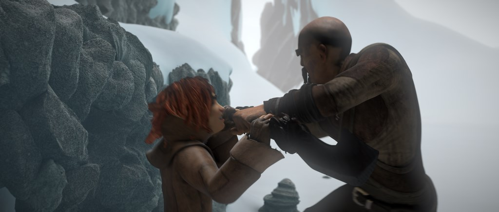
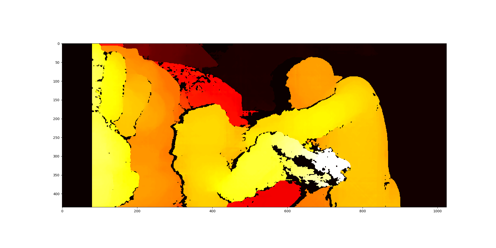

# 🎛️ **Stereo Depth Map Generation**

This project showcases how to generate a **depth map** from a pair of stereo images using Python's **OpenCV** and **NumPy** libraries. The depth map allows you to estimate the distance of objects from the camera by calculating disparities between two stereo images.

---

## 🔍 **Overview**

The core of this project is the Python class `Depth`, which processes two stereo images (left and right) to generate a depth map. It leverages **Semi-Global Block Matching (SGBM)**, a powerful algorithm for computing disparity maps. The resulting depth map visually represents the distance of objects in the scene based on the camera’s **focal length** and **baseline distance**.

### ✨ **Key Features**

- Converts stereo images to **grayscale** for depth computation.
- Uses **SGBM** to calculate the **disparity map**.
- Transforms the disparity map into a **depth map** using camera parameters.
- Displays the final **depth map** with clear visualization.

---

## 🎥 **Demo**

### 📷 **Input Images (Left and Right)**

 

### 🖼️ **Depth Map (After Processing)**



The resulting depth map highlights **closer objects** in **brighter yellow** and **distant objects** in **darker red**, providing a heatmap-style visualization.

---

## ⚙️ **Installation**

Ensure the required dependencies are installed:

```bash
pip install opencv-python numpy
```

---

## 🚀 **Usage**

1. **Clone the Repository:**

   ```bash
   git clone https://github.com/your-username/stereo-depth-map.git
   cd stereo-depth-map
   ```

2. **Prepare Stereo Images:**

   Place your stereo images (`left_img.png` and `right_img.png`) in the project folder.

3. **Run the Script:**

   ```bash
   python depth_map.py
   ```

   The **depth map** will be displayed in a window.

---

## 🔧 **Code Breakdown**

The `Depth` class implements the following steps:

1. **Input**: Loads the left and right stereo images.
2. **Grayscale Conversion**: Converts the images to **grayscale**.
3. **Disparity Map Calculation**: Computes the disparity map using `cv2.StereoSGBM_create`.
4. **Depth Map Calculation**: The disparity map is transformed into a depth map using the formula:  
`depth = (focal_length × baseline) / disparity`
5. **Normalization & Visualization**: The depth map is **normalized** and displayed for clear visual interpretation.

---

## 🛠️ **Example Code**

```python
import cv2
import numpy as np
from depth_map import Depth

# Load images
left_img = cv2.imread('left_img.png')
right_img = cv2.imread('right_img.png')

# Generate and display depth map
depth = Depth(left_img, right_img)
depth.get()
```

---
